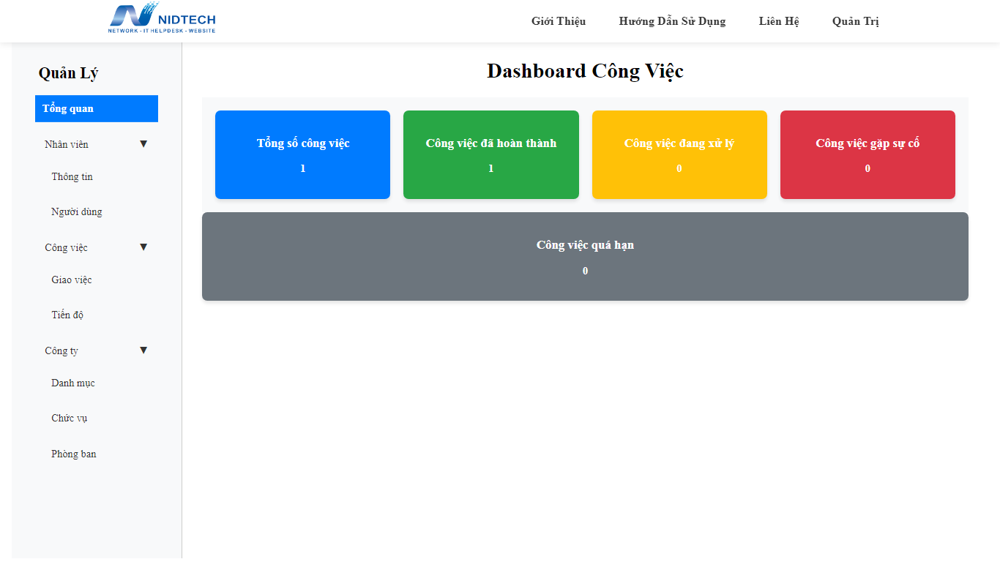

# Quản Lý Phân Công Công Việc

Dự án **Quản Lý Phân Công Công Việc** được xây dựng bằng PHP. Website cung cấp tiến trình phân công công việc trong công ty với các tính năng thân thiện và dễ sử dụng.

## Chức Năng Chính
1. **Quản lý nhân viên**:
   - Hiển thị danh sách nhân viên.
   - Tìm kiếm, thêm, xóa, sửa, cật nhật thông tin
   - Chi tiết nhân viên:
   + Thông tin đăng nhập: username, password
   + Thông tin cá nhân: tên, vị trí, chức vụ, phòng ban,...

2. **Quản lý thông tin cơ bản của công ty**:
   - Hiển thị danh sách phòng ban, chức vụ, danh mục.
   - Tìm kiếm, thêm, xóa, sửa

3. **Quản lý công việc**:
   - Giao việc: thêm, xóa, sửa, phân công.
   - Tính toán tiến độ hoàn thành công việc

4. **Quản trị viên**:
   - Quản lý phân công
   - Quản lý nhân viên
   - Quản lý thông tin cơ bản công ty

5. **Người dùng**:
   - Xem và cật nhật trạng thái công việc
   - Cật nhật thông tin cá nhân

---

## Công Nghệ Sử Dụng
- **Ngôn ngữ**: PHP.
- **Cơ sở dữ liệu**: PhpMyAdmin.
- **HTML/CSS/JavaScript**: Giao diện người dùng.

---
# Chạy website
**Tải về và giải nén - để các tệp, thư mục dự án bên ngoài thư mục gốc của trang web, cật nhật CSDL và mối kết nối**

